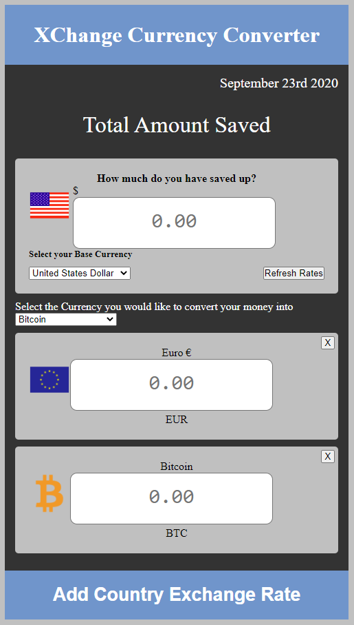

# Project 1: XChange Currency Converter

## Description
Even with all the technology at our fingertips, most of us have experienced so little of what the world has to offer. Stuck in quarantine, people have started planning their dream vacations for the day that Covid-19 is over, and we can begin to travel again. As we dream, where do we start with our travel goals? Do you know what your dollar is worth around the world? How much do you need to save for that trip to South America? With the XChange Currency Converter, you can build and plan your finances to take that trip and stop waiting for "tomorrow". 

## Usage
The Currency Converter will allow the user to enter how much they have saved in a given (base) currency depending on the country/currency of their choice. Then the user will be able to convert their currency to whichever currency they need for their specific destination/s. 

## Features
*Alert the user if they have enough money saved for said trip, if they have an excess balance, or how much they still need to save. 
*Allow the user to see their current currency conversions in real time with the currency API. 
*Allow the user to also use crypto currency and the exchange rates if they choose this currency type. 
*Disclaimer-some countries ban the use of crypto currency. 

## Visuals
<a href="https://bbrintle.github.io/project1/">Visit Site</a>
 

## API/Framework Used
<a href="https://www.coingecko.com/en/api#explore-api">CoinGecko (Crypto API)</a>
<a href="https://www.exchangerate-api.com/">ExchangeRate-API</a>
<a href="https://www.countryflags.io/">Country Flags API</a>
<a href="https://bulma.io/">Bulma (CSS Framework)</a>

## Road Map
Future deployments and add-ons are to allow for hotel booking, airline booking, car rentals, along with the ability to convert currency ahead of time and save in a digital debit card for security purposes. 

## Authors
This was created by Blake Brintle, Irene Novelo, Jesus Gonzalez, and Maira Acevedo 

## License
* © 2019 Trilogy Education Services, a 2U, Inc. brand. All Rights Reserved.

- - -

